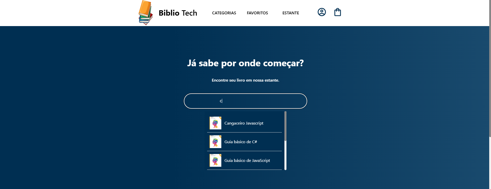
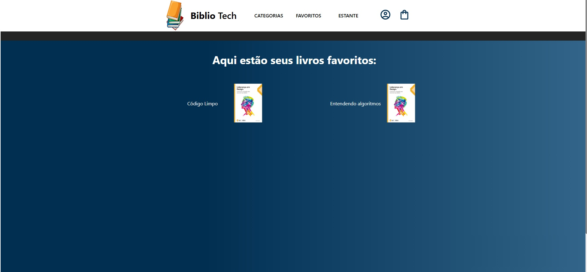

<h1 align="center" style="font-weight: bold;">Project name 💻</h1>

<p align="center">
  
  
  
  
  
  
  
</p>

<p align="center">
 <a href="#sobre">Sobre</a> • 
 <a href="#executar">Executar Projeto</a> • 
 <a href="#rotas">Rotas</a> • 
 <a href="#eu">Sobre mim</a> 
</p>

<p align="center">
    
</p>
<p align="center">
    
</p>
<p align="center">
    
</p>

<h2 id="sobre">📌 Sobre</h2>

BiblioTech é uma biblioteca virtual focada em livros de tecnologia. Nela você pode favoritar seus livros preferidos e ficar por dentro do mundo tech.

Este projeto foi elaborado para colocar em prática os conhecimentos adquiridos em React e Node.js, juntamente com uma série de cursos da plataforma Alura.  
**Nota:** O projeto não utiliza banco de dados — todos os dados e imagens estão salvos localmente.

<h2 id="executar">🚀 Executar Projeto</h2>

<h3>Pré-requisitos</h3>

- [NodeJS](https://nodejs.org/en)
- [Nodemon](https://www.npmjs.com/package/nodemon)

<h3>Clonagem</h3>

```bash
git clone https://github.com/MiguelJDelgado/BiblioTech.git
```

<h3>Instalação de dependências</h3>

```bash
cd ./caminho/BiblioTech/frontend
npm install
```

<h3>Execução</h3>

<h4>Frontend</h4>

```bash
cd ./caminho/BiblioTech/frontend
npm run dev
```

<h4>Backend</h4>

```bash
cd ./caminho/BiblioTech/backend
nodemon app.js
```

<h2 id="rotas">📍 Rotas</h2>

| Rota                  | Descrição                                                                                  |
|-----------------------|--------------------------------------------------------------------------------------------|
| <kbd>/</kbd>          | Página inicial com todos os livros. É possível favoritar livros e visualizar lançamentos. |
| <kbd>/favoritos</kbd> | Lista dos livros marcados como favoritos.                                                 |
| <kbd>/estante</kbd>   | Em desenvolvimento...                                                                      |
| <kbd>/categorias</kbd>| Em desenvolvimento...                                                                      |

<h2 id="eu">🧑‍💻 Sobre mim</h2>

Este projeto ainda está em desenvolvimento. Caso queira conhecer mais sobre mim, segue abaixo:

[](https://www.linkedin.com/in/miguel-delgado-544384339/)
[](https://github.com/MiguelJDelgado)
[](https://www.instagram.com/mig630/)

<h4>Segue abaixo o Readme do meu perfil no GitHub, para que possa me conhecer melhor 😁.</h4>

[](https://github.com/MiguelJDelgado)
